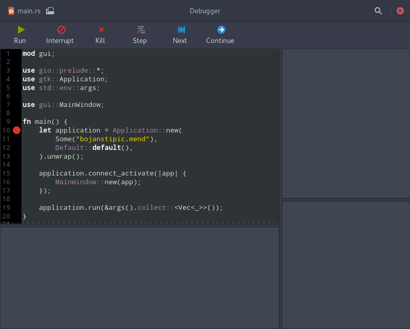

# mend

[GTK](https://www.gtk.org/) GUI frontend for [GDB](https://www.gnu.org/software/gdb/) debugger.
Debugger mend is written in Rust programming language and uses [Gtk-rs](https://gtk-rs.org/) bindings for GTK.



## Prerequisites

* GTK 3.24
* GtkSourceView 3.24
* pkgconf
* Rust compiler

## Installation

Compile and install with Cargo:
```bash
cargo build --release
cargo install --path .
```

## Usage

```bash
mend [FILE]
```

## License

	mend
	Copyright (C) 2019 Bojan Stipic

	This program is free software: you can redistribute it and/or modify
	it under the terms of the GNU General Public License as published by
	the Free Software Foundation, either version 3 of the License, or
	(at your option) any later version.

	This program is distributed in the hope that it will be useful,
	but WITHOUT ANY WARRANTY; without even the implied warranty of
	MERCHANTABILITY or FITNESS FOR A PARTICULAR PURPOSE.  See the
	GNU General Public License for more details.

	You should have received a copy of the GNU General Public License
	along with this program.  If not, see <http://www.gnu.org/licenses/>.
